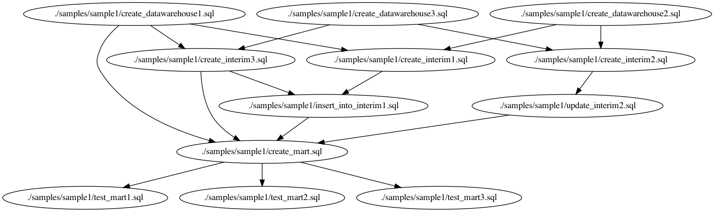

## AlphaSQL

This repository is forked from [google/zetasql](https://github.com/google/zetasql) and provides BigQuery Parallelizer and Type Checker for SQL set.

## Docker

You can run commands below with docker

```bash
docker run -it --rm -v `pwd`:/home:Z matts966/alphasql:latest [command]
```

like

```bash
docker run -it --rm -v `pwd`:/home:Z matts966/alphasql:latest pipeline_type_checker ./samples/sample1.dot
```

Commands are installed in PATH.

## Extract DAG from SQL set

```bash
# To extract DAG from your SQL set
$ ./bin/osx/dag --output_path ./samples/sample1.dot ./samples/sample1/

# with graphviz
$ dot -Tpng samples/sample1.dot -o samples/sample1.png
```

Note that sometimes the output has cycle and manual editing is needed.

### Sample DAG output

The image below is extracted from SQL set in `./samples/sample1` .



## SQL set Pipeline level Type Check

Note that you should run type_checker in the same path as in extracting DAG.

```bash
# to check type and schema of SQL set
$ ./bin/osx/pipeline_type_checker ./samples/sample1.dot
analyzing ./samples/sample1/create_datawarehouse3.sql...
DDL analyzed, adding table to catalog...
SUCCESS: analysis finished!
catalog:
        datawarehouse3
analyzing ./samples/sample1/create_datawarehouse2.sql...
DDL analyzed, adding table to catalog...
SUCCESS: analysis finished!
catalog:
        datawarehouse3
        datawarehouse2
analyzing ./samples/sample1/create_interium2.sql...
DDL analyzed, adding table to catalog...
SUCCESS: analysis finished!
catalog:
        datawarehouse3
        datawarehouse2
        interium2
analyzing ./samples/sample1/update_interium2.sql...
SUCCESS: analysis finished!
catalog:
        datawarehouse3
        datawarehouse2
        interium2
analyzing ./samples/sample1/create_datawarehouse1.sql...
DDL analyzed, adding table to catalog...
SUCCESS: analysis finished!
catalog:
        datawarehouse1
        interium2
        datawarehouse2
        datawarehouse3
analyzing ./samples/sample1/create_interium3.sql...
DDL analyzed, adding table to catalog...
SUCCESS: analysis finished!
catalog:
        datawarehouse1
        interium2
        datawarehouse2
        datawarehouse3
        interium3
analyzing ./samples/sample1/create_interium1.sql...
DDL analyzed, adding table to catalog...
SUCCESS: analysis finished!
catalog:
        datawarehouse1
        interium2
        datawarehouse2
        interium1
        datawarehouse3
        interium3
analyzing ./samples/sample1/insert_into_interium1.sql...
SUCCESS: analysis finished!
catalog:
        datawarehouse1
        interium2
        datawarehouse2
        interium1
        datawarehouse3
        interium3
analyzing ./samples/sample1/create_mart.sql...
DDL analyzed, adding table to catalog...
SUCCESS: analysis finished!
catalog:
        datawarehouse1
        interium2
        datawarehouse2
        interium1
        datawarehouse3
        mart
        interium3
```

If you change column `x`'s type in `./samples/create_datawarehouse1.sql` to `STRING`, type checking will fail.

```bash
$ ./bin/osx/pipeline_type_checker ./samples/sample1.dot
analyzing ./samples/sample1/create_datawarehouse3.sql...
DDL analyzed, adding table to catalog...
SUCCESS: analysis finished!
catalog:
        datawarehouse3
analyzing ./samples/sample1/create_datawarehouse2.sql...
DDL analyzed, adding table to catalog...
SUCCESS: analysis finished!
catalog:
        datawarehouse3
        datawarehouse2
analyzing ./samples/sample1/create_interium2.sql...
DDL analyzed, adding table to catalog...
SUCCESS: analysis finished!
catalog:
        datawarehouse3
        datawarehouse2
        interium2
analyzing ./samples/sample1/update_interium2.sql...
SUCCESS: analysis finished!
catalog:
        datawarehouse3
        datawarehouse2
        interium2
analyzing ./samples/sample1/create_datawarehouse1.sql...
DDL analyzed, adding table to catalog...
SUCCESS: analysis finished!
catalog:
        datawarehouse3
        datawarehouse2
        datawarehouse1
        interium2
analyzing ./samples/sample1/create_interium3.sql...
ERROR: INVALID_ARGUMENT: Column 1 in UNION ALL has incompatible types: STRING, INT64 [at 4:1]
```

You can specify external schemata (not created by queries in SQL set) by passing JSON schema path.

```bash
# with external schema
$ ./bin/osx/pipeline_type_checker --json_schema_path ./sample-schema.json ./samples/sample1.dot
```

You can extract required external tables by

```bash
$ ./bin/osx/dag --external_required_tables_output_path ./required_tables.txt {./path/to/sqls}
# and get schemata using bq command
$ cat {./path/to/sqls} | while read line
do
    bq show \
        --schema \
        --format=prettyjson \
        $line
done
```

JSON schema file should have only a top level `table_shecmas` list element, and string `name` and `scheme` elements for each tables. `name` and `type` elements in `scheme` elements are recognized as column type like a official API.

```json
{
    "table_shecmas": [
        {
            "name": "tablename1",
            "schema": [
                {"mode": "NULLABLE", "name": "column1", "type": "STRING", "description": null},
            ]
        },
        {
            "name": "tablename2",
            "schema": [
                {"mode": "NULLABLE", "name": "column1", "type": "STRING", "description": null},
                {"mode": "NULLABLE", "name": "column2", "type": "INT64", "description": null},
            ]
        }
    ]
}
```

## Parallel Execution

The output DAG can be run parallely using [bq_jobrunner](https://github.com/tsintermax/bq_jobrunner) and Python.

```Python
from bq_jobrunner.bq_jobrunner import BQJobrunner

path_to_dag_dot = "./path/to/dag.dot"

runner = BQJobrunner(
    PROJECT_ID,
    location=REGION,
)
runner.compose_query_by_dot_path(path_to_dag_dot)
runner.execute()
```

Note that you should run job_runner in the same path as in extracting DAG.

## License

[Apache License 2.0](LICENSE)

## Support Disclaimer
This is not an officially supported Google product.
