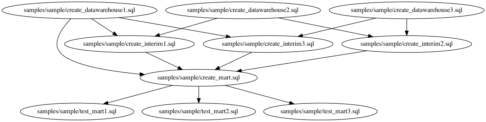

# AlphaSQL

[](https://github.com/Matts966/alphasql/actions?query=workflow%3Arelease)
[](https://github.com/Matts966/alphasql/actions?query=branch%3Amaster+workflow%3Atest+)

AlphaSQL provides **Automatic Parallelization** for sets of SQL files and integrated **Type/Scheme Checker** to eliminate syntax, type and schema errors from your datawarehouse.

## Features

- [Docker Image](#docker-image)
    - Use our AlphaSQL on Docker ；）
- [Fast Binaries](#fast-binaries)
    - For local use, binary installation is fast!
- [Dependency Analysis](#extract-dag-from-sql-set)
    - Extract DAG from your SQL file set.
    - [Sample DAG output](#sample-dag-output)
- [Parallel Execution](#parallel-execution)
    - Automatically parallelize your SQL file set.
- [Schema Checker](#pipeline-level-type-check-for-sql-set)
    - Eliminate syntax, type and schema errors from your datawarehouse.
    - [Schema specification by JSON](#schema-specification-by-json)
        - Input your lake schema in JSON.
- [CI Example](#ci-example)
    - Use our AlphaSQL to continuously check your datawarehouse on BigQuery using CloudBuild.

## Docker Image

You can run commands below with docker

```bash
docker run --rm -v `pwd`:/home matts966/alphasql:latest [command]
```

like

```bash
docker run --rm -v `pwd`:/home matts966/alphasql:latest pipeline_type_checker ./samples/sample/dag.dot
```

Commands are installed in the PATH of the image.

## Fast Binaries

```bash
# To install for MacOSX
temp=$(mktemp -d)
wget -P $temp https://github.com/Matts966/alphasql/releases/latest/download/alphasql_darwin_x86_64.tar.gz \
    && sudo tar -zxvf $temp/alphasql_darwin_x86_64.tar.gz -C /usr/local/bin
```

```bash
# To install for Linux
temp=$(mktemp -d)
wget -P $temp https://github.com/Matts966/alphasql/releases/latest/download/alphasql_linux_x86_64.tar.gz \
    && sudo tar -zxvf $temp/alphasql_linux_x86_64.tar.gz -C /usr/local/bin --strip=1
```

## Extract DAG from SQL set

`dag` finds dependencies between table references and create table statements.

```bash
# To extract DAG from your SQL set
$ dag --output_path ./samples/sample/dag.dot ./samples/sample/

# Or you can check the output in stdout by
$ dag [paths]

# with graphviz
$ dot -Tpng samples/sample/dag.dot -o samples/sample/dag.png
```

Note that sometimes the output has cycle, and refactoring SQL files or manual editing of the dot file is needed (see [this issue](https://github.com/Matts966/alphasql/issues/2)).

If there are cycles, warning is emitted, type checker reports error, and bq_jobrunner raise error before execution. You can see the example in [./samples/sample-cycle](./samples/sample-cycle) .

If you want to serially execute some statements, you can write SQL script that contains multiple statements. See [samples/sample/create_interim1.sql](samples/sample/create_interim1.sql) as an example.

### Sample DAG output

The image below is extracted from SQL set in [./samples/sample](./samples/sample) . You can write tests for created tables and run them parallely only by separating SQL file.



## Parallel Execution

For BigQuery, the output DAG can be run parallely using [bq_jobrunner](https://github.com/tsintermax/bq_jobrunner) and Python.

```Python
from bq_jobrunner.bq_jobrunner import BQJobrunner

FILE_PATH = "./path/to/dag.dot"
PROJECT_ID = "your-project-id"
REGION = "asia-northeast1" # your region

runner = BQJobrunner(
    PROJECT_ID,
    location=REGION,
)
runner.compose_query_by_dot_path(FILE_PATH)
runner.execute()
```

Note that you should run job_runner in the same path as in extracting DAG.

## Pipeline level Type Check for SQL set

Note that you should run type_checker in the same path as in extracting DAG.

```bash
# to check type and schema of SQL set
$ pipeline_type_checker ./samples/sample.dot
Analyzing "./samples/sample/create_datawarehouse3.sql"
DDL analyzed, adding table to catalog...
SUCCESS: analysis finished!
Analyzing "./samples/sample/create_datawarehouse2.sql"
DDL analyzed, adding table to catalog...
SUCCESS: analysis finished!
Analyzing "./samples/sample/create_interim2.sql"
DDL analyzed, adding table to catalog...
SUCCESS: analysis finished!
Analyzing "./samples/sample/update_interim2.sql"
SUCCESS: analysis finished!
Analyzing "./samples/sample/create_datawarehouse1.sql"
DDL analyzed, adding table to catalog...
SUCCESS: analysis finished!
Analyzing "./samples/sample/create_interim3.sql"
DDL analyzed, adding table to catalog...
SUCCESS: analysis finished!
Analyzing "./samples/sample/create_interim1.sql"
DDL analyzed, adding table to catalog...
SUCCESS: analysis finished!
Analyzing "./samples/sample/update_interium1.sql"
SUCCESS: analysis finished!
Analyzing "./samples/sample/insert_into_interim1.sql"
SUCCESS: analysis finished!
Analyzing "./samples/sample/create_mart.sql"
DDL analyzed, adding table to catalog...
SUCCESS: analysis finished!
Analyzing "./samples/sample/test_mart1.sql"
SUCCESS: analysis finished!
Analyzing "./samples/sample/test_mart2.sql"
SUCCESS: analysis finished!
Analyzing "./samples/sample/test_mart3.sql"
SUCCESS: analysis finished!
Successfully finished type check!
```

If you change column `x`'s type in `./samples/sample/create_datawarehouse3.sql` to `STRING`, type checker reports error.

```bash
$ pipeline_type_checker ./samples/sample/dag.dot
Analyzing "./samples/sample/create_datawarehouse3.sql"
DDL analyzed, adding table to catalog...
SUCCESS: analysis finished!
Analyzing "./samples/sample/create_datawarehouse2.sql"
DDL analyzed, adding table to catalog...
SUCCESS: analysis finished!
Analyzing "./samples/sample/create_interim2.sql"
ERROR: INVALID_ARGUMENT: Column 1 in UNION ALL has incompatible types: INT64, STRING [at ./samples/sample/create_interim2.sql:7:1]
catalog:
        datawarehouse3
        datawarehouse2
```

### Schema specification by JSON

You can specify external schemata (not created by queries in SQL set) by passing JSON schema path.

```bash
# with external schema
$ pipeline_type_checker --json_schema_path ./samples/sample-schema.json ./samples/sample/dag.dot
```

You can extract required external tables by

```bash
$ dag --external_required_tables_output_path ./required_tables.txt {./path/to/sqls}
# and get schemata using bq command
$ cat ./required_tables.txt | while read line
do
    bq show \
        --schema \
        --format=prettyjson \
        $line
done
```

JSON schema file should have only a top level map element keyed by string element, which specifies table name, and each value specifies schema for its key. `name` and `type` elements in the schema elements are recognized like the official API.

```json
{
        "tablename1": [
                {"mode": "NULLABLE", "name": "column1", "type": "STRING", "description": null}
        ],
        "tablename2": [
                {"mode": "NULLABLE", "name": "column1", "type": "STRING", "description": null},
                {"mode": "NULLABLE", "name": "column2", "type": "INT64", "description": null}
        ]
}
```

## CI Example

The pipeline level type check above is also useful in CI context. The sample in [./samples/sample-ci](./samples/sample-ci) contains an example for extracting dag, retrieving schema and checking schema and type of SQL set quering bigquery public dataset. You can introduce the CI to your environment only by copying `cloudbuild_ci_sample.yaml` and `python_entrypoint.py` to your project.

You can try the example CI with `gcloud` command by

```
(cd ./samples/sample-ci && gcloud builds submit --config=cloudbuild_ci_sample.yaml .)
```

This example does not execute actual BigQuery.

## License

[Apache License 2.0](LICENSE)

## Sponsors

The development of this project is sponsored by [Japan Data Science Consortium](https://jdsc.ai/) and [Cybozu Lab](https://labs.cybozu.co.jp/).
