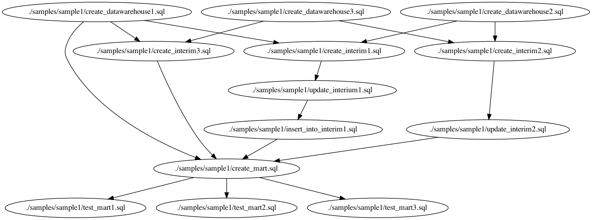

## AlphaSQL

This repository is forked from [google/zetasql](https://github.com/google/zetasql) and provides integrated Type/Scheme Checker and Parallelization for SQL set.

## Docker

You can run commands below with docker

```bash
docker run --rm -v `pwd`:/home matts966/alphasql:latest [command]
```

like

```bash
docker run --rm -v `pwd`:/home matts966/alphasql:latest pipeline_type_checker ./samples/sample1/dag.dot
```

Commands are installed in the PATH of the image.

Also, binaries for Linux and OSX are in [bin](./bin) directory.

## Extract DAG from SQL set

```bash
# To extract DAG from your SQL set
$ ./bin/osx/dag --output_path ./samples/sample1/dag.dot ./samples/sample1/

# Or you can check the output in stdout by
$ ./bin/osx/dag [paths]

# with graphviz
$ dot -Tpng samples/sample1/dag.dot -o samples/sample1/dag.png
```

Note that sometimes the output has cycle and manual editing is needed ([issue](https://github.com/Matts966/alphasql/issues/2)).

If there are cycles, warning is emitted. You can see the example in [./samples/sample-cycle](./samples/sample-cycle) .

### Sample DAG output

The image below is extracted from SQL set in [./samples/sample1](./samples/sample1) . You can write tests for created tables and run them parallely only by separating SQL file.



## Parallel Execution

The output DAG can be run parallely using [bq_jobrunner](https://github.com/tsintermax/bq_jobrunner) and Python.

```Python
from bq_jobrunner.bq_jobrunner import BQJobrunner

FILE_PATH = "./path/to/dag.dot"
PROJECT_ID = "your-project-id"
REGION = "asia-northeast1" # your region

runner = BQJobrunner(
    PROJECT_ID,
    location=REGION,
)
runner.compose_query_by_dot_path(FILE_PATH)
runner.execute()
```

Note that you should run job_runner in the same path as in extracting DAG.

## Pipeline level Type Check for SQL set

Note that you should run type_checker in the same path as in extracting DAG.

```bash
# to check type and schema of SQL set
$ ./bin/osx/pipeline_type_checker ./samples/sample1.dot
Analyzing "./samples/sample1/create_datawarehouse3.sql"
DDL analyzed, adding table to catalog...
SUCCESS: analysis finished!
Analyzing "./samples/sample1/create_datawarehouse2.sql"
DDL analyzed, adding table to catalog...
SUCCESS: analysis finished!
Analyzing "./samples/sample1/create_interim2.sql"
DDL analyzed, adding table to catalog...
SUCCESS: analysis finished!
Analyzing "./samples/sample1/update_interim2.sql"
SUCCESS: analysis finished!
Analyzing "./samples/sample1/create_datawarehouse1.sql"
DDL analyzed, adding table to catalog...
SUCCESS: analysis finished!
Analyzing "./samples/sample1/create_interim3.sql"
DDL analyzed, adding table to catalog...
SUCCESS: analysis finished!
Analyzing "./samples/sample1/create_interim1.sql"
DDL analyzed, adding table to catalog...
SUCCESS: analysis finished!
Analyzing "./samples/sample1/update_interium1.sql"
SUCCESS: analysis finished!
Analyzing "./samples/sample1/insert_into_interim1.sql"
SUCCESS: analysis finished!
Analyzing "./samples/sample1/create_mart.sql"
DDL analyzed, adding table to catalog...
SUCCESS: analysis finished!
Analyzing "./samples/sample1/test_mart1.sql"
SUCCESS: analysis finished!
Analyzing "./samples/sample1/test_mart2.sql"
SUCCESS: analysis finished!
Analyzing "./samples/sample1/test_mart3.sql"
SUCCESS: analysis finished!
Successfully finished type check!
```

If you change column `x`'s type in `./samples/sample1/create_datawarehouse3.sql` to `STRING`, type checker reports error.

```bash
$ pipeline_type_checker ./samples/sample1/dag.dot
Analyzing "./samples/sample1/create_datawarehouse3.sql"
DDL analyzed, adding table to catalog...
SUCCESS: analysis finished!
Analyzing "./samples/sample1/create_datawarehouse2.sql"
DDL analyzed, adding table to catalog...
SUCCESS: analysis finished!
Analyzing "./samples/sample1/create_interim2.sql"
ERROR: INVALID_ARGUMENT: Column 1 in UNION ALL has incompatible types: INT64, STRING [at ./samples/sample1/create_interim2.sql:7:1]
catalog:
        datawarehouse3
        datawarehouse2
```

You can specify external schemata (not created by queries in SQL set) by passing JSON schema path.

```bash
# with external schema
$ ./bin/osx/pipeline_type_checker --json_schema_path ./samples/sample-schema.json ./samples/sample1/dag.dot
```

You can extract required external tables by

```bash
$ ./bin/osx/dag --external_required_tables_output_path ./required_tables.txt {./path/to/sqls}
# and get schemata using bq command
$ cat ./required_tables.txt | while read line
do
    bq show \
        --schema \
        --format=prettyjson \
        $line
done
```

JSON schema file should have only a top level map element keyed by string element, which specifies table name, and each value specifies schema for its key. `name` and `type` elements in the schema elements are recognized like the official API.

```json
{
        "tablename1": [
                {"mode": "NULLABLE", "name": "column1", "type": "STRING", "description": null}
        ],
        "tablename2": [
                {"mode": "NULLABLE", "name": "column1", "type": "STRING", "description": null},
                {"mode": "NULLABLE", "name": "column2", "type": "INT64", "description": null}
        ]
}
```

## CI Example

The pipeline level type check above is also useful in CI context. The sample in [./samples/sample-ci](./samples/sample-ci) contains an example for extracting dag, retrieving schema and checking schema and type of SQL set quering bigquery public dataset. You can introduce the CI to your environment only by copying `cloudbuild_ci_sample.yaml` and `python_entrypoint.py` to your project.

You can try the example CI with `gcloud` command by

```
(cd ./samples/sample-ci && gcloud builds submit --config=cloudbuild_ci_sample.yaml .)
```

This example does not execute actual BigQuery.

## License

[Apache License 2.0](LICENSE)

## Support Disclaimer
This is not an officially supported Google product.
