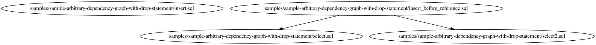

# Sample Arbitrary Dependency Graph With Drop Statement

This sample shows how to construct arbitrary dependency graph by dummy tables.

In project root, you can try the commands below

```bash
$ # extract graph
$ alphadag ./samples/sample-arbitrary-dependency-graph-with-drop-statement/ --output_path \
    ./samples/sample-arbitrary-dependency-graph-with-drop-statement/dag.dot
$ # visualize graph
$ dot -Tpng ./samples/sample-arbitrary-dependency-graph-with-drop-statement/dag.dot \
    -o ./samples/sample-arbitrary-dependency-graph-with-drop-statement/dag.png
$ # type check
$ alphacheck ./samples/sample-arbitrary-dependency-graph-with-drop-statement/dag.dot \
    --json_schema_path ./samples/sample-arbitrary-dependency-graph-with-drop-statement/schema.json
```


