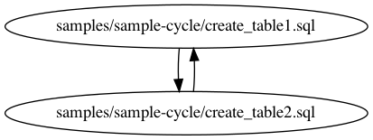

# Sample Cycle

This sample shows the result caused by cycles in SQL Set.

In project root, you can try the commands below

```bash
$ # extract graph
$ dag ./samples/sample-cycle/ --output_path ./samples/sample-cycle/dag.dot
reading "./samples/sample-cycle/create_table2.sql"
reading "./samples/sample-cycle/create_table1.sql"
Warning!!! There are cycles in your dependency graph!!!

$ # visualize graph
$ dot -Tpng ./samples/sample-cycle/dag.dot -o ./samples/sample-cycle/dag.png
```


